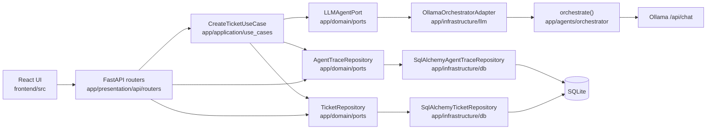

# ITSM GenIA

Local IT service-management assistant: a user submits a title and description, a four-agent Ollama pipeline classifies and prioritizes the ticket, drafts a structured support answer, and the result is stored in SQLite. The UI is a React console for listing, creating, commenting on, and escalating tickets.

This is a hackathon MVP, not a multi-tenant production ITSM. What follows is what the repository actually does today.

## Architecture

Request flow for ticket creation (the only path that goes through a use-case):



Layers live under `backend/app/`: `presentation` (HTTP), `application` (use-cases), `domain` (entities and ports), `infrastructure` (SQLAlchemy and the Ollama adapter). Comments still query the session from the router; they do not go through a use-case.

The four agents run **in sequence**: clasificador → priorizador → soporte → analítico. Later agents receive earlier JSON as context. Each call has a timeout, retries on connection/timeout errors, typed field fallbacks on failure, and a row in `agent_traces`.

More detail: [docs/architecture.md](docs/architecture.md). Why the split exists: [docs/adr/0001-clean-architecture-layering.md](docs/adr/0001-clean-architecture-layering.md). Why the pipeline is sequential: [docs/adr/0002-agent-orchestration-strategy.md](docs/adr/0002-agent-orchestration-strategy.md). Schema changes: [backend/MIGRATIONS.md](backend/MIGRATIONS.md).

## Tech stack

Declared in the repo (unpinned packages have no version here on purpose):

| Area | What is used |
| --- | --- |
| API | Python 3.11, FastAPI, Uvicorn, Pydantic Settings ≥2.3 |
| Persistence | SQLAlchemy, Alembic 1.19.1, SQLite |
| LLM client | httpx 0.28.1 against a host Ollama (`llama3.2` by default) |
| Frontend | React 18.2, React Router 6.22, Axios 1.7, Vite 5, TypeScript 5.2 |
| Tests / CI | pytest 9.1.1, pytest-asyncio, pytest-cov, respx 0.22.0; GitHub Actions for pytest and Gitleaks |

Ollama is **not** a Compose service. It must already be running on the host.

## Setup

### Prerequisites

- Docker with Compose
- [Ollama](https://ollama.com) on the host, with the model the pipeline requests:

```bash
ollama pull llama3.2
ollama serve
```

Confirm `http://localhost:11434` answers before starting the stack.

### Docker (supported path)

From the repository root. Compose injects `DATABASE_URL` and `OLLAMA_BASE_URL`; you do not need a `.env` file for this path. The backend image runs `alembic upgrade head` before Uvicorn.

```bash
docker compose up --build
```

- API: http://localhost:8000 — OpenAPI at http://localhost:8000/docs
- UI: http://localhost:5173
- SQLite file: `data/itsm.db` (mounted into the container as `/app/data/itsm.db`)

CORS defaults allow `http://localhost:5173` and `http://localhost:3000`. A `*` origin is rejected at startup because credentials are enabled.

If `data/itsm.db` already existed **before** Alembic was introduced, do not recreate it. Stamp it first (see [backend/MIGRATIONS.md](backend/MIGRATIONS.md)); otherwise `alembic upgrade head` will fail with “table already exists”.

### Local Python / Node (optional)

Use this when you are not using Compose. Copy env defaults, install, migrate, then start both processes:

```bash
cp backend/.env.example backend/.env
# edit DATABASE_URL / OLLAMA_* if needed

cd backend
python -m venv .venv
# Windows: .venv\Scripts\activate
# Unix:    source .venv/bin/activate
pip install -r requirements.txt
alembic upgrade head
uvicorn app.main:app --reload --host 0.0.0.0 --port 8000
```

```bash
cd frontend
npm install
npm run dev
```

`AUTO_CREATE_SCHEMA` in `.env.example` defaults to `false`. Leave it false; Alembic owns the schema. `LOG_LEVEL` is accepted by settings but is not wired into Python logging yet.

## Demo

1. Open http://localhost:5173 and create a ticket (title + description only).
2. Wait for the four-agent run (up to 60s per Ollama call, with retries on timeouts).
3. Open the ticket: structured steps, priority, category, comments, and “escalate to human” (`POST .../escalate`).
4. Inspect the pipeline from a terminal:

```bash
curl -s http://localhost:8000/api/v1/tickets/1/trace
```

The UI does not render traces today; the endpoint does.

If Ollama is down, creation still returns **201** with the per-agent fallback values (for example tipo `incidente`, prioridad `P3`) and trace rows with `success: false`.

## API reference

Interactive docs: http://localhost:8000/docs

Prefix: `/api/v1`

| Method | Path | Role |
| --- | --- | --- |
| `POST` | `/tickets` | Create; runs the agent pipeline |
| `GET` | `/tickets` | List; filters `q`, `fecha_desde`, `fecha_hasta`, `urgencia`, `tipo`, `categoria`, `prioridad`, `area_responsable` |
| `GET` | `/tickets/{id}` | Fetch one |
| `GET` | `/tickets/{id}/trace` | Four `AgentTrace` rows, oldest first |
| `POST` | `/tickets/{id}/escalate` | Set `escalado_a_humano` |
| `POST` | `/tickets/{id}/comments` | Add comment / optional 1–5 rating |
| `GET` | `/tickets/{id}/comments` | Comments plus average rating |
| `GET` | `/health` | Liveness HTML |
| `GET` | `/` | JSON pointer to `/docs` and `/health` |

```bash
curl -s -X POST http://localhost:8000/api/v1/tickets \
  -H "Content-Type: application/json" \
  -d "{\"titulo\":\"VPN caída\",\"descripcion\":\"No puedo acceder al ERP desde la oficina.\"}"

curl -s "http://localhost:8000/api/v1/tickets?prioridad=P1"

http POST :8000/api/v1/tickets titulo="VPN caída" descripcion="No puedo acceder al ERP."
http GET :8000/api/v1/tickets prioridad==P1
```

## Testing

The suite mocks every Ollama HTTP call (respx) and uses throwaway SQLite files. It does not need a running Ollama or the real `data/itsm.db`.

```bash
cd backend
pip install -r requirements.txt -r requirements-dev.txt
pytest --cov=app --cov-report=term-missing
```

Coverage of: `CreateTicketUseCase`, SQLAlchemy repositories, Alembic revisions, ticket/trace API, orchestrator retry/fallback, settings. There is no frontend test suite. Comments have no dedicated API tests. CI: `.github/workflows/backend-tests.yml` and `.github/workflows/secret-scan.yml`.

## Known limitations

- **SQLite only.** One file, one writer-friendly process, no Postgres/migrations-for-Postgres path.
- **No authentication or authorization.** Every endpoint is open. CORS is an origin allow-list, not access control.
- **Single instance.** No queue, no horizontal scaling, no multi-region story.
- **Ollama on the host.** Compose does not start the model. A missing or slow model makes ticket creation take minutes (4 calls × timeout × retries).
- **Sequential agents.** Clasificador output is required context for priorizador; soporte and analítico wait on both. Parallelism is not implemented.
- **Partial layering.** Tickets and traces use ports/repositories. Comments still call `db.query(...)` in `comments.py`. List/get/escalate tickets have no use-case class.
- **Sync SQLAlchemy on the event loop.** `POST /tickets` is `async`, but commits are synchronous.
- **Observability is thin.** Traces persist best-effort (a failed insert does not fail the ticket). `LOG_LEVEL` is unused. No structured logging package.
- **Frontend gaps.** No login, no trace view, no automated UI tests. The production Docker stage copies `dist/` without a `vite build` step; Compose uses the development target only.
- **Startup path.** `app/main.py` always `os.makedirs("/app/data")`, which is the container path. Local Windows runs may create `C:\app\data` as a side effect.
- **Unpinned runtime libs.** FastAPI, Uvicorn, and SQLAlchemy have no versions in `requirements.txt`.

## Roadmap

Not implemented. Next-phase work that follows from the gaps above:

- Move comments (and remaining ticket handlers) onto the same port / use-case pattern as create-ticket.
- Optional parallel run of soporte and analítico after priorizador returns.
- Async SQLAlchemy (or a threadpool) so LLM waits do not share the loop with blocking commits.
- PostgreSQL as an optional `DATABASE_URL`, with Alembic covering both dialects.
- Authentication on mutating routes.
- Surface `GET /tickets/{id}/trace` in the ticket detail page.
- Pin runtime dependencies and wire `LOG_LEVEL` into logging.
