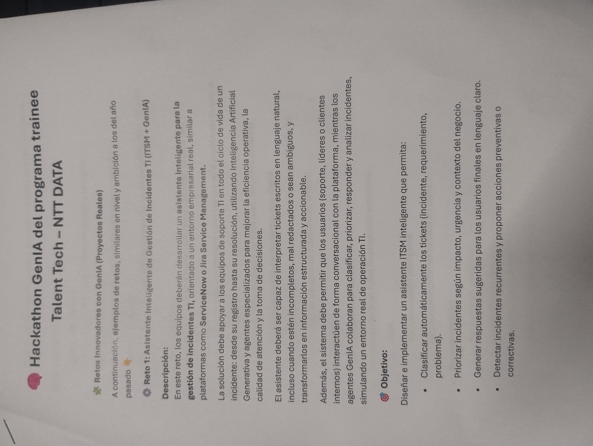
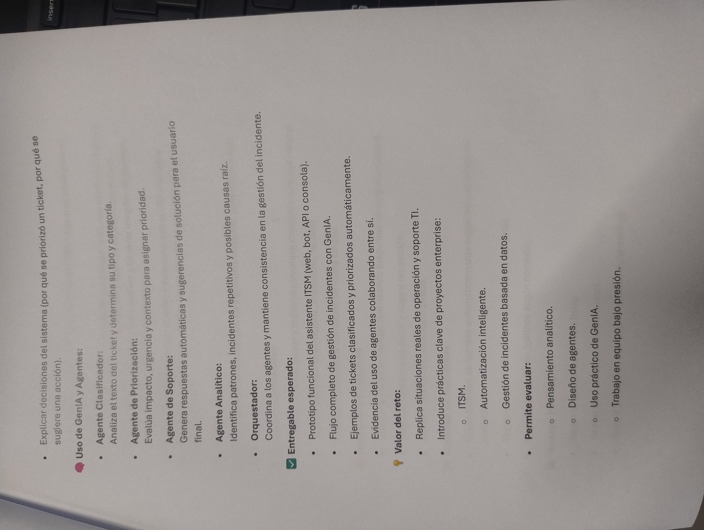
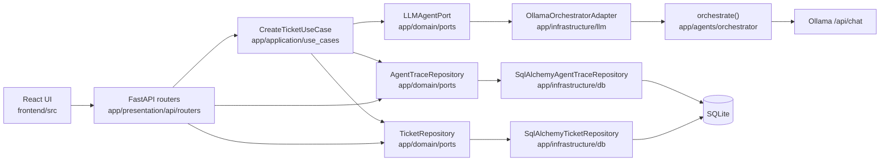

# ITSM GenIA (HACKATHON GENIA del programa trainee Talent Tech - NTT DATA

Asistente local de gestión de servicios de TI: un usuario envía un título y una descripción, un pipeline de cuatro agentes Ollama clasifica y prioriza el ticket, redacta una respuesta de soporte estructurada, y el resultado se guarda en SQLite. La UI es una consola React para listar, crear, comentar y escalar tickets.

## Capturas

<p align="center">
  <a href="imagenes/hackatom_Prueba.jpg">
    
  </a>
  <a href="imagenes/hackatom_Prueba2.jpg">
    
  </a>
</p>

Esto es un MVP de hackathon, no un ITSM de producción multi-tenant. Lo que sigue es lo que el repositorio hace realmente hoy.

## Arquitectura

Flujo de la petición para la creación de tickets (el único camino que pasa por un caso de uso):



Las capas viven bajo `backend/app/`: `presentation` (HTTP), `application` (casos de uso), `domain` (entidades y puertos), `infrastructure` (SQLAlchemy y el adaptador de Ollama). Los comentarios siguen consultando la sesión desde el router; no pasan por un caso de uso.

Los cuatro agentes se ejecutan **en secuencia**: clasificador → priorizador → soporte → analítico. Los agentes posteriores reciben el JSON anterior como contexto. Cada llamada tiene un timeout, reintentos ante errores de conexión/timeout, valores de respaldo tipados ante fallo, y una fila en `agent_traces`.

Más detalle: [docs/architecture.md](docs/architecture.md). Por qué existe la separación: [docs/adr/0001-clean-architecture-layering.md](docs/adr/0001-clean-architecture-layering.md). Por qué el pipeline es secuencial: [docs/adr/0002-agent-orchestration-strategy.md](docs/adr/0002-agent-orchestration-strategy.md). Cambios de esquema: [backend/MIGRATIONS.md](backend/MIGRATIONS.md).

## Stack tecnológico

Declarado en el repo (los paquetes sin pin no tienen versión aquí a propósito):

| Área | Qué se usa |
| --- | --- |
| API | Python 3.11, FastAPI, Uvicorn, Pydantic Settings ≥2.3 |
| Persistencia | SQLAlchemy, Alembic 1.19.1, SQLite |
| Cliente LLM | httpx 0.28.1 contra un Ollama en el host (`llama3.2` por defecto) |
| Frontend | React 18.2, React Router 6.22, Axios 1.7, Vite 5, TypeScript 5.2 |
| Tests / CI | pytest 9.1.1, pytest-asyncio, pytest-cov, respx 0.22.0; GitHub Actions para pytest y Gitleaks |

Ollama **no** es un servicio de Compose. Debe estar ya en ejecución en el host.

## Configuración

### Requisitos previos

- Docker con Compose
- [Ollama](https://ollama.com) en el host, con el modelo que el pipeline solicita:

```bash
ollama pull llama3.2
ollama serve
```

Confirma que `http://localhost:11434` responde antes de arrancar el stack.

### Docker (camino soportado)

Desde la raíz del repositorio. Compose inyecta `DATABASE_URL` y `OLLAMA_BASE_URL`; no necesitas un archivo `.env` para este camino. La imagen del backend ejecuta `alembic upgrade head` antes de Uvicorn.

```bash
docker compose up --build
```

- API: http://localhost:8000 — OpenAPI en http://localhost:8000/docs
- UI: http://localhost:5173
- Archivo SQLite: `data/itsm.db` (montado en el contenedor como `/app/data/itsm.db`)

Los valores por defecto de CORS permiten `http://localhost:5173` y `http://localhost:3000`. Un origen `*` se rechaza al arrancar porque las credenciales están habilitadas.

Si `data/itsm.db` ya existía **antes** de que se introdujera Alembic, no lo recrees. Marca el stamp primero (véase [backend/MIGRATIONS.md](backend/MIGRATIONS.md)); de lo contrario `alembic upgrade head` fallará con “table already exists”.

### Python / Node local (opcional)

Usa esto cuando no estés usando Compose. Copia los valores por defecto de entorno, instala, migra y luego arranca ambos procesos:

```bash
cp backend/.env.example backend/.env
# edit DATABASE_URL / OLLAMA_* if needed

cd backend
python -m venv .venv
# Windows: .venv\Scripts\activate
# Unix:    source .venv/bin/activate
pip install -r requirements.txt
alembic upgrade head
uvicorn app.main:app --reload --host 0.0.0.0 --port 8000
```

```bash
cd frontend
npm install
npm run dev
```

`AUTO_CREATE_SCHEMA` en `.env.example` vale `false` por defecto. Déjalo en false; Alembic es dueño del esquema. `LOG_LEVEL` es aceptado por settings pero aún no está conectado al logging de Python.

## Demo

1. Abre http://localhost:5173 y crea un ticket (solo título + descripción).
2. Espera la ejecución de los cuatro agentes (hasta 60s por llamada a Ollama, con reintentos ante timeouts).
3. Abre el ticket: pasos estructurados, prioridad, categoría, comentarios y “escalar a humano” (`POST .../escalate`).
4. Inspecciona el pipeline desde una terminal:

```bash
curl -s http://localhost:8000/api/v1/tickets/1/trace
```

La UI no renderiza las trazas hoy; el endpoint sí.

Si Ollama está caído, la creación igual devuelve **201** con los valores de respaldo por agente (por ejemplo tipo `incidente`, prioridad `P3`) y filas de traza con `success: false`.

## Referencia de la API

Documentación interactiva: http://localhost:8000/docs

Prefijo: `/api/v1`

| Método | Ruta | Rol |
| --- | --- | --- |
| `POST` | `/tickets` | Crear; ejecuta el pipeline de agentes |
| `GET` | `/tickets` | Listar; filtros `q`, `fecha_desde`, `fecha_hasta`, `urgencia`, `tipo`, `categoria`, `prioridad`, `area_responsable` |
| `GET` | `/tickets/{id}` | Obtener uno |
| `GET` | `/tickets/{id}/trace` | Cuatro filas `AgentTrace`, la más antigua primero |
| `POST` | `/tickets/{id}/escalate` | Establece `escalado_a_humano` |
| `POST` | `/tickets/{id}/comments` | Añadir comentario / valoración opcional 1–5 |
| `GET` | `/tickets/{id}/comments` | Comentarios más valoración media |
| `GET` | `/health` | HTML de liveness |
| `GET` | `/` | Puntero JSON a `/docs` y `/health` |

```bash
curl -s -X POST http://localhost:8000/api/v1/tickets \
  -H "Content-Type: application/json" \
  -d "{\"titulo\":\"VPN caída\",\"descripcion\":\"No puedo acceder al ERP desde la oficina.\"}"

curl -s "http://localhost:8000/api/v1/tickets?prioridad=P1"

http POST :8000/api/v1/tickets titulo="VPN caída" descripcion="No puedo acceder al ERP."
http GET :8000/api/v1/tickets prioridad==P1
```

## Testing

La suite mockea cada llamada HTTP a Ollama (respx) y usa archivos SQLite desechables. No necesita un Ollama en ejecución ni el `data/itsm.db` real.

```bash
cd backend
pip install -r requirements.txt -r requirements-dev.txt
pytest --cov=app --cov-report=term-missing
```

Cobertura de: `CreateTicketUseCase`, repositorios SQLAlchemy, revisiones de Alembic, API de tickets/trazas, reintento/respaldo del orquestador, settings. No hay suite de tests de frontend. Los comentarios no tienen tests de API dedicados. CI: `.github/workflows/backend-tests.yml` y `.github/workflows/secret-scan.yml`.

## Limitaciones conocidas

- **Solo SQLite.** Un archivo, un proceso amigable con un único escritor, sin Postgres ni un camino de migraciones para Postgres.
- **Sin autenticación ni autorización.** Todos los endpoints están abiertos. CORS es una lista de orígenes permitidos, no control de acceso.
- **Instancia única.** Sin cola, sin escalado horizontal, sin historia multi-región.
- **Ollama en el host.** Compose no arranca el modelo. Un modelo ausente o lento hace que la creación de tickets tarde minutos (4 llamadas × timeout × reintentos).
- **Agentes secuenciales.** La salida del clasificador es contexto requerido para el priorizador; soporte y analítico esperan a ambos. El paralelismo no está implementado.
- **Capas parciales.** Tickets y trazas usan puertos/repositorios. Los comentarios siguen llamando `db.query(...)` en `comments.py`. Listar/obtener/escalar tickets no tienen clase de caso de uso.
- **SQLAlchemy síncrono en el event loop.** `POST /tickets` es `async`, pero los commits son síncronos.
- **La observabilidad es delgada.** Las trazas se persisten con best-effort (un insert fallido no falla el ticket). `LOG_LEVEL` no se usa. No hay paquete de logging estructurado.
- **Huecos del frontend.** Sin login, sin vista de trazas, sin tests automáticos de UI. El stage de producción de Docker copia `dist/` sin un paso `vite build`; Compose usa solo el target de desarrollo.
- **Camino de arranque.** El directorio de SQLite se crea a partir del padre de `DATABASE_URL`, no de una ruta fija `/app/data`.
- **Librerías de runtime sin pin.** FastAPI, Uvicorn y SQLAlchemy no tienen versiones en `requirements.txt`.

## Hoja de ruta

No implementado. Trabajo de la siguiente fase que se sigue de los huecos anteriores:

- Mover comentarios (y los handlers de tickets restantes) al mismo patrón de puerto / caso de uso que create-ticket.
- Ejecución paralela opcional de soporte y analítico después de que el priorizador responda.
- SQLAlchemy asíncrono (o un threadpool) para que las esperas del LLM no compartan el loop con commits bloqueantes.
- PostgreSQL como `DATABASE_URL` opcional, con Alembic cubriendo ambos dialectos.
- Autenticación en las rutas que mutan.
- Mostrar `GET /tickets/{id}/trace` en la página de detalle del ticket.
- Fijar las dependencias de runtime y conectar `LOG_LEVEL` al logging.
