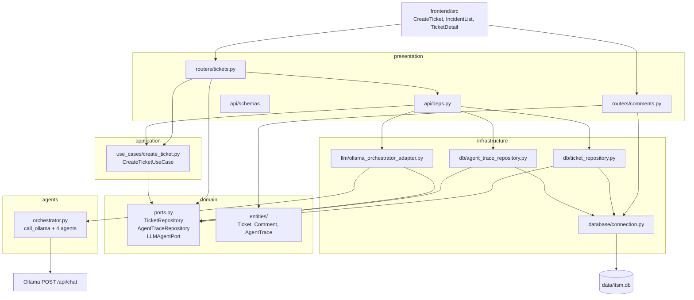

# Architecture

This is the layout that exists under `backend/app/` and `frontend/src/` today, not a target state. The README diagram is the short version of the same picture.

## Components

## Ticket creation (implemented)

1. `POST /api/v1/tickets` in `app/presentation/api/routers/tickets.py` (`async def create_ticket`).
2. FastAPI injects `CreateTicketUseCase` from `app/presentation/api/deps.py`.
3. `execute()` awaits `LLMAgentPort.analyze()` — production adapter is `OllamaOrchestratorAdapter`.
4. The adapter awaits `orchestrate()` in `app/agents/orchestrator.py`, which calls the four agents **in this order**, reusing one `httpx.AsyncClient`:
   - `agente_clasificador` → tipo, categoria, subcategoria, confianza
   - `agente_priorizador` (receives classification) → prioridad, impacto, urgencia, area_responsable
   - `agente_soporte` (classification + prioritization) → structured user answer
   - `agente_analitico` (classification + prioritization) → es_recurrente, causa_raiz, accion_preventiva
5. `call_ollama` times the call, retries `TimeoutException` / `ConnectError` with exponential backoff, fails fast on HTTP 4xx/5xx, and always returns a `(dict, AgentTraceRecord)` pair. An empty dict triggers the agent’s hardcoded defaults.
6. `CreateTicketUseCase` builds a `Ticket`, `TicketRepository.add()` commits it, then `AgentTraceRepository.add_traces()` writes four rows. Trace failures are logged and swallowed.

List, get, and escalate use `TicketRepository` directly from the router. They have no use-case class.

## Comments (implemented, different shape)

`app/presentation/api/routers/comments.py` takes `Session` via `get_db` and runs `db.query(Ticket)` / `db.query(Comment)`. There is no `CommentRepository` and no comment use-case.

## Persistence

| Table | ORM | How it is created |
| --- | --- | --- |
| `tickets` | `app/domain/entities/ticket.py` | Alembic revision `0001` |
| `comments` | `app/domain/entities/comment.py` | Alembic revision `0001` |
| `agent_traces` | `app/domain/entities/agent_trace.py` | Alembic revision `0002` |
| `alembic_version` | — | Alembic |

`Base.metadata.create_all` runs only when `settings.AUTO_CREATE_SCHEMA` is true (default false). Runtime URL: `app/core/config.py` → `app/infrastructure/database/connection.py`. Alembic `env.py` reads the same `settings.DATABASE_URL`.

## Frontend

React Router routes in `frontend/src/App.tsx`:

| Path | Page | API calls |
| --- | --- | --- |
| `/`, `/incidents` | `IncidentList` | `GET /api/v1/tickets` |
| `/create` | `CreateTicket` | `POST /api/v1/tickets` |
| `/tickets/:id` | `TicketDetail` | `GET` ticket + comments; `POST` comment; escalate via `HumanSupportModal` |

Base URL: `import.meta.env.VITE_API_URL ?? "http://localhost:8000"`. The UI does not call `/trace`.

## Configuration

`app/core/config.py` (`Settings`) is the only module that reads the environment. Relevant keys: `DATABASE_URL`, `OLLAMA_BASE_URL`, `OLLAMA_MODEL`, `OLLAMA_TIMEOUT_SECONDS`, `OLLAMA_MAX_RETRIES`, `OLLAMA_RETRY_BACKOFF_SECONDS`, `CORS_ALLOWED_ORIGINS`, `LOG_LEVEL` (unused by logging), `APP_ENV`, `AUTO_CREATE_SCHEMA`.
